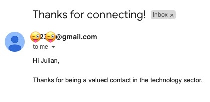

# Node-RED HubSpot Integration

## 🧩 Overview
This project retrieves contacts from HubSpot, filters by industry, and sends automated emails.

## 🚀 Setup Instructions

1. Install Node-RED.
    ```sh
    sudo npm install -g --unsafe-perm node-red
    ```

2. Set environment variable for `HUBSPOT_API_KEY`.
   ```sh 
   export HUBSPOT_API_KEY=my-apy-key
   ```
3. Start Node-RED.
    ```sh
    node-red
    ```

4. Install required `node-red-node-email` node.
    ```sh 
    (Menu -> Settings -> Palette -> Install -> Search dependency)
    ```

5. Import the `flow_1.json` flow into Node-RED.
    ```sh
    (Menu -> Import)
    ```
   
6. Configure SMTP in `Send Email` node

7. Create `email_log.jsonl` file and configure file path in the `Read Log File`, `Append to Log File` nodes.

## 🔄 Flow


## 📦 Flow Groups
- **Read Logs:** Reads locally saved Log File
- **Fetch Data:** Fetches Contacts from HubSpot API
- **Extract Data:** Extracts Contacts and Filters them by industry (technology)
- **Email Check:** For each contact, check if it was  notified in the past 24h, and if not, send email.
- **Send Email:** Composes Email, Sends Email and updates Log File

## ✅ Testing
Use the Inject node `Start Process` to trigger manually or run on schedule. Check Debug panel or log file for errors.

## 📩 Email



